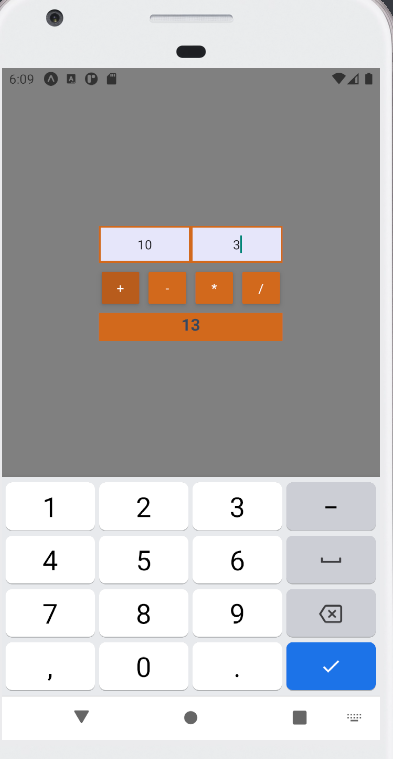
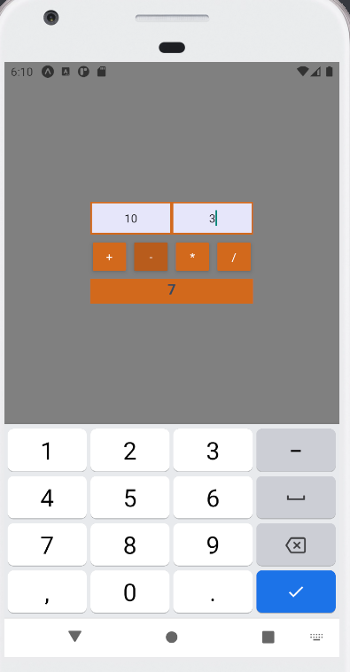
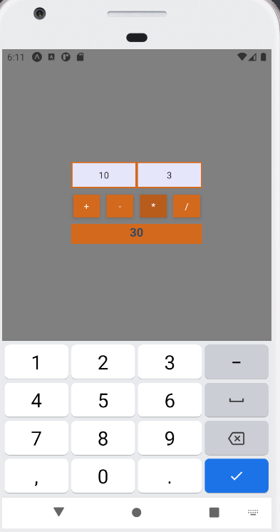
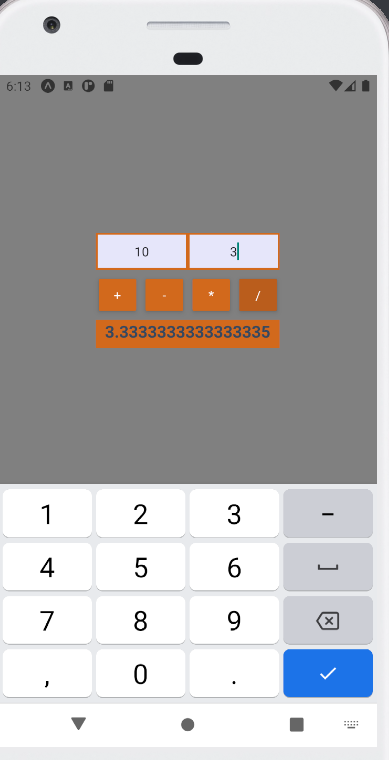

# Laboratorium numer 1

Laboratorium miało na celu skonfigurowanie środowiska pracy oraz stworzyć prosty kalkulator przy użyciu React Native.

Kalkulator wykonano przy użyciu Expo, co pozwoliło na proste stworzenie pierwszej aplikacji w tej technologii. 

## Zrzuty ekranu

Dodawanie:

Odejmowanie:

Mnożenie:

Dzielenie:

