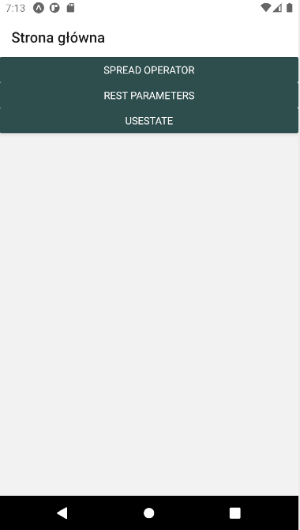
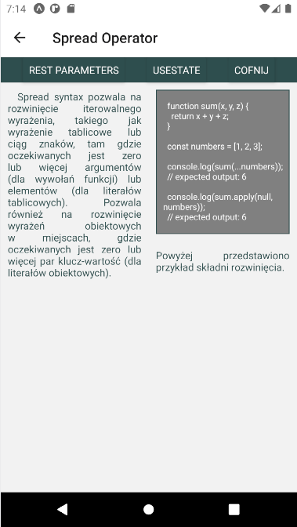
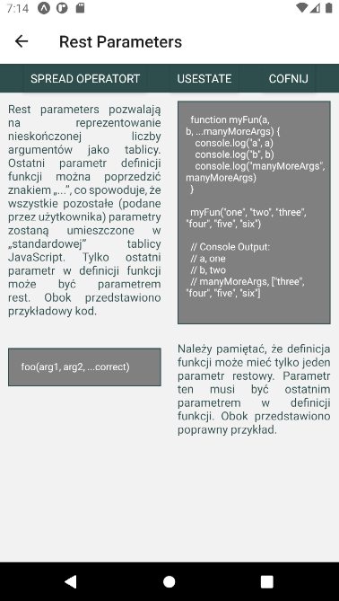
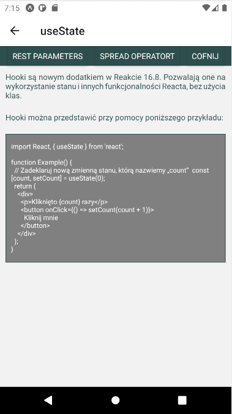

# Lab2
Do stworzenia projektu wykorzystano Expo.

W ramach laboratorium należało utowrzyć 3 ekrany za pomocą react-navigation, a do przemieszczania się użyto stack-navigator.

Na ekranach umieszczono informacje o spread operator, czym są rest parameters oraz do czego służy 'hook' useState.

Dodatkowo ostylowano ekarny przy użyciu Flexboxa. Style zostały umieszczone w pliku styles.js.

## Zrzuty ekranu

Strona główna:

Spread Operator:

Rest Parameters:

useState:

