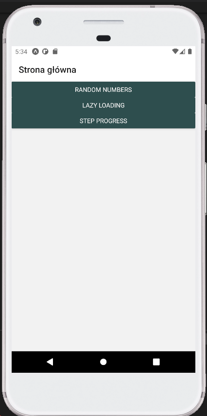
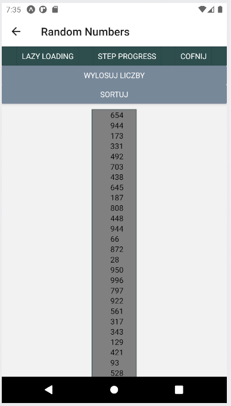
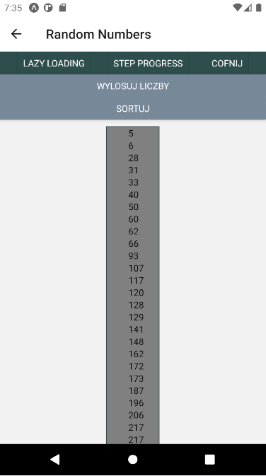
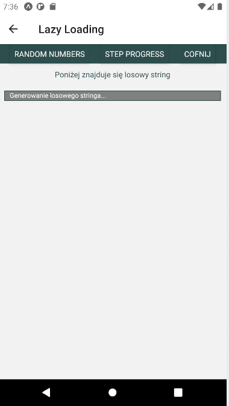
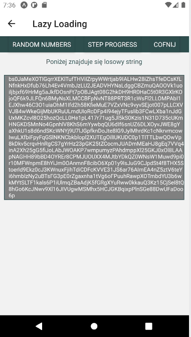
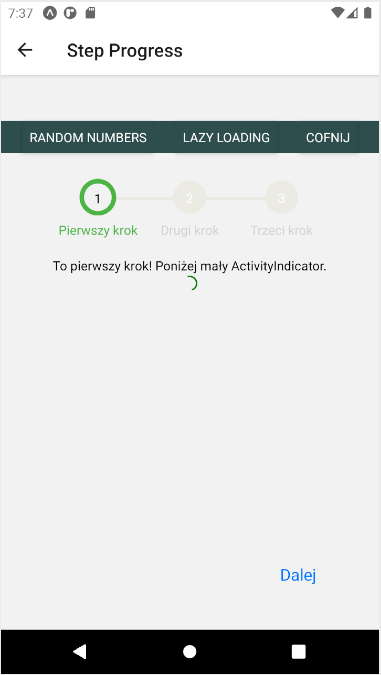
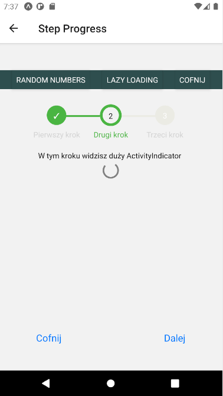
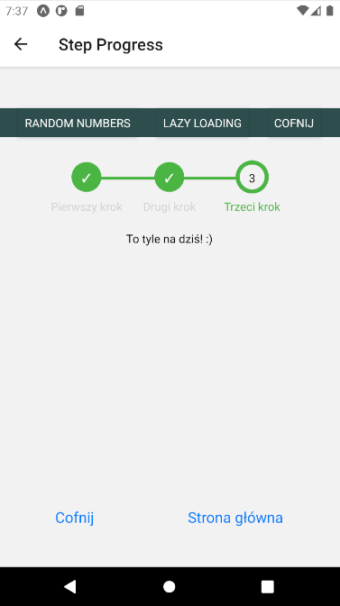

# Lab3
Do stworzenia projektu wykorzystano Expo.

W ramach laboratorium wykonano:
 - widok z wygenerowanymi 100 pseudolosowymi liczbami z możliwością ponownego wygenerowania i posortowania;
 - ekran z zaimplementowanym leniwym ładowaniem zawierającym losowo wygenerowany string;
 - widok z progresem krokowym zawierający ActivityIndicator.

## Zrzuty ekranu

Strona główna:

Wygenerowane losowe liczby:

Posortowane liczby:

Lazy loading - ładowanie:

Lazy loading - załadowany string:

Step progress - krok pierwszy:

Step progress - krok drugi:

Step progress - krok trzeci:

