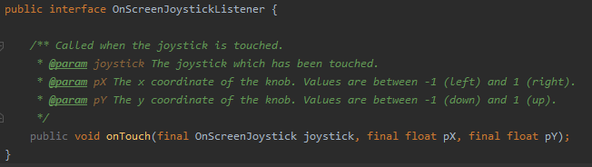
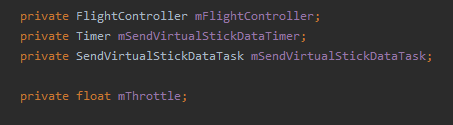
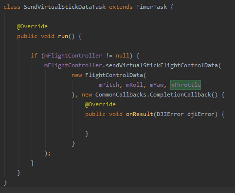
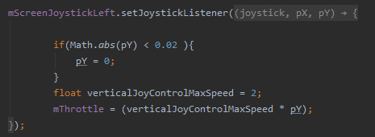
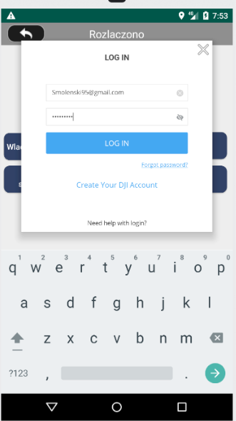

# Lab5
Repozytorium zawiera wybrane fragmenty aplikacji sterującej dronem wykorzystującej sensory urządzenia mobilnego oraz API udostępniane przez firmę DJI.

Laboratorium miało na celu obsługę danych wprowadzanych przez użytkownika

Wprowadzanymi danymi były wartości wychyleń joysticka, który steruje wysokością lotu oraz email i hasło wprowadzane podczas pierwszego uruchomienia aplikacji.

Jako joystick zostały wykorzystany open sourcowy projekt OnScreenJoystick.

Podczas ruchu joystickiem wywoływana jest metoda onTouch interfejsu OnScreenJoystickListener:

Dekalracja zmiennych:

Zmienna mThrottle otrzymuje dane o wychyleniu joysticka i służy do sterowania wysokością lotu.

Następnie zostaje rozszerzona klasa TimerTask, aby utworzyć klasę SendVirtualStickDataTask. W środku wywołana jest metoda sendVirtualStickFlightControlData(), która wysyła dane sterujące lotem.

Metoda aktualizuje wartości wychyleń joysticka, które przekazywane są do zmiennej odpowiedzialnej za sterowanie wysokością lotu.

Dodatkowo zaimplementowane zostało logowanie w celu weryfikacji konta developerskiego:

