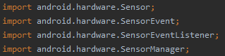
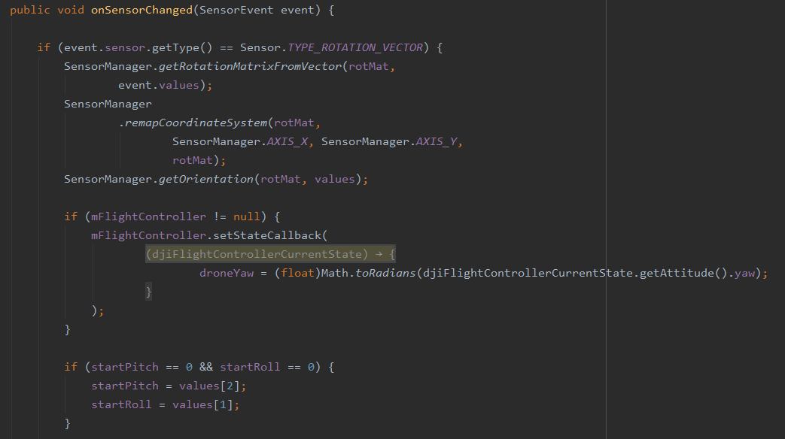
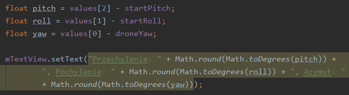
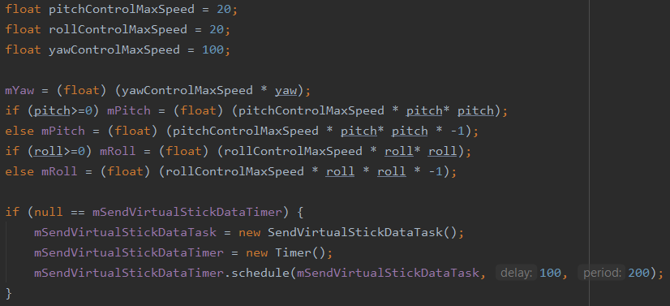
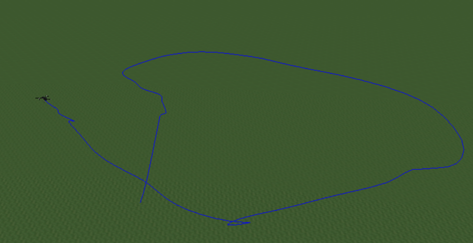
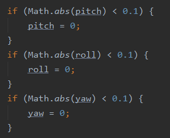
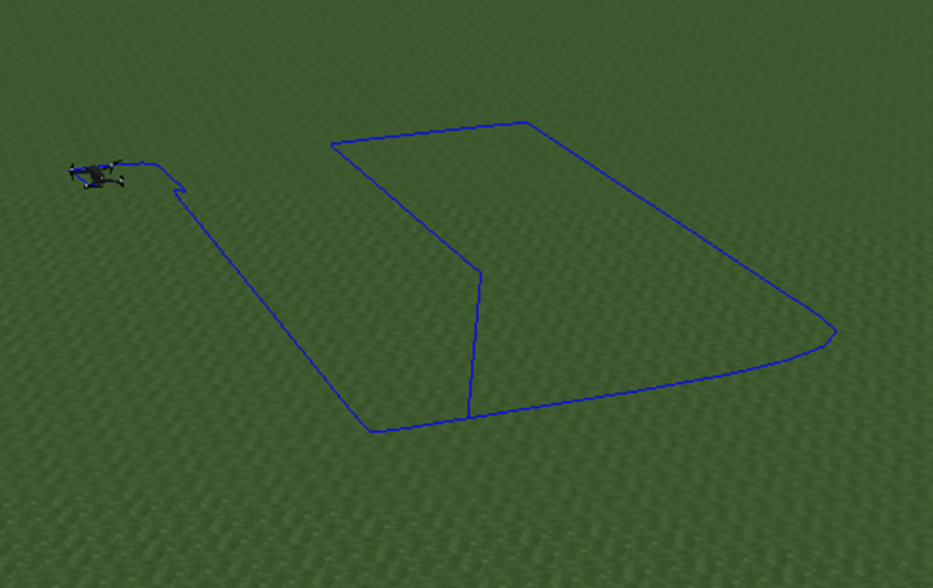

# Lab5
Repozytorium zawiera wybrane fragmenty aplikacji sterującej dronem wykorzystującej sensory urządzenia mobilnego.

Laboratorium miało na celu zapoznanie się z obsługą gestów użytkownika. W przedstawionym przypadku gestami użytkownaika były odchylenia smartfonu i pozwalały na sterowanie wartością azymutu, pochylenia i przechylenia drona.

## Zrzuty ekranu

Import bibliotek:

Ustalenie początkowych wartości przechylenia, pochylenia i azymutu:

Ustalenie odchyleń smartfonu od początkowych wartości:

Końcowa obróbka danych mająca na celu "łagodniejsze" startowanie drona i wysłanie ich jako polecenia sterujące:

Lot drona przy wykorzystaniu sensorów - widać w nim brak precyzji lotu:

Poprawka niwelująca odczytywanie niewielkich ruchów smartfonu pozwalająca na łatwiejsze sterowanie:

Lot po wprowadzeniu poprawki:

