# Lab6
Do stworzenia projektu wykorzystano Expo.

W ramach laboratorium wykonano widoki z:
 - ładowaniem 2 obrazków (wykorzystanie URI oraz require())
 - zmianą wielkości obrazka za pomocą komponentu Slider
 - 'leniwym' ladowaniem obrazu oraz renderowaniem różnych ikon
 - detekcją łączności i wyświetlenie informacji z tym związanych
 - zapisem i odczytem danych przy pomocy AsyncStorage
 - synchronizacją danych (wartości suwaka) w przypadku łączności z siecią

## Zrzuty ekranu

Strona główna:

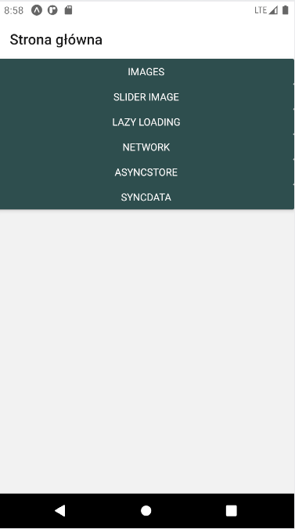

Wykorzystanie URI oraz require():

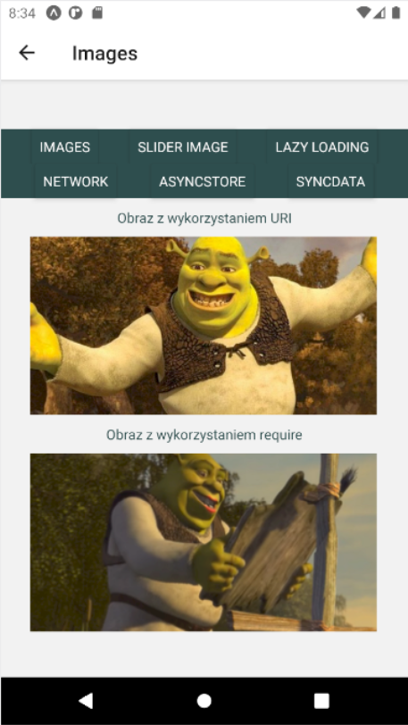

Kod:

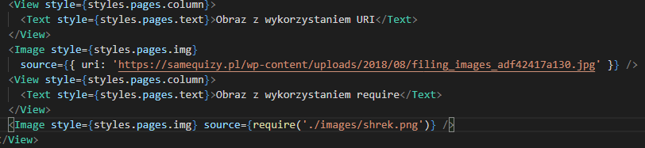

Zmiana wielkości obrazka za pomocą komponentu Slider:

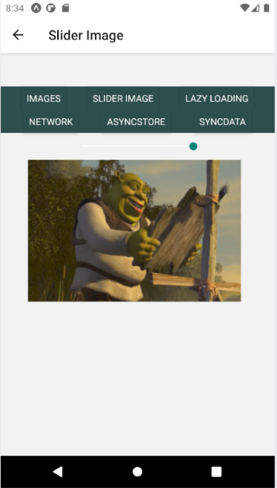

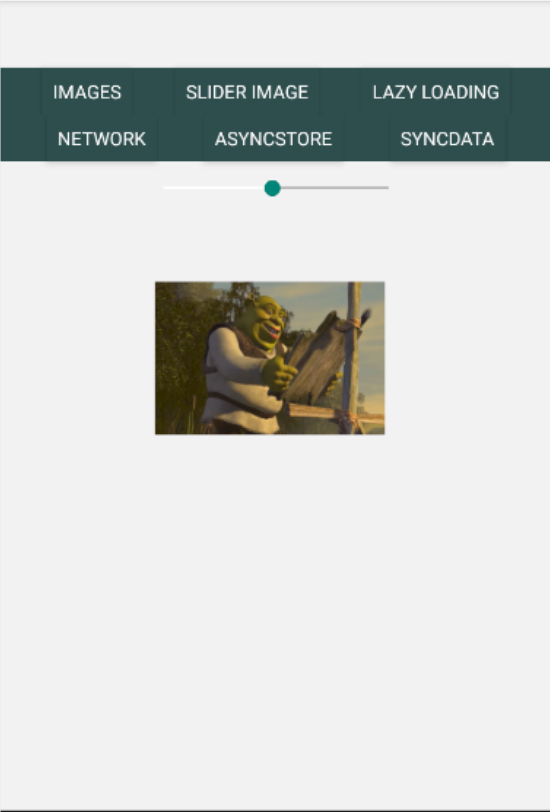

Kod:

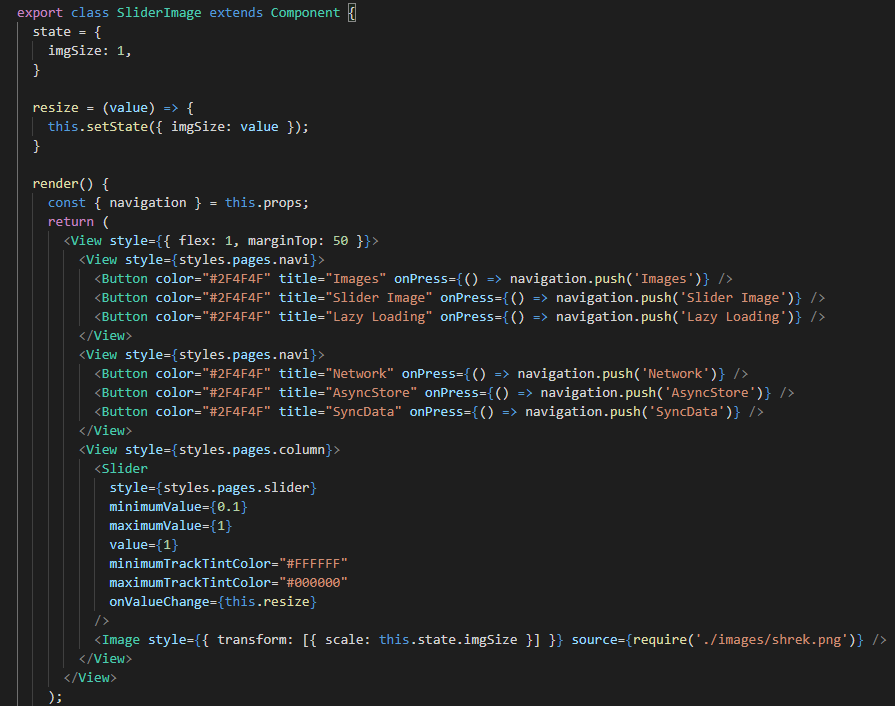

Leniwe ładowanie: 

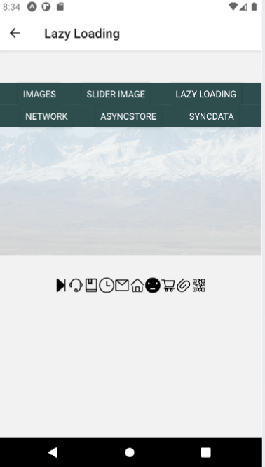

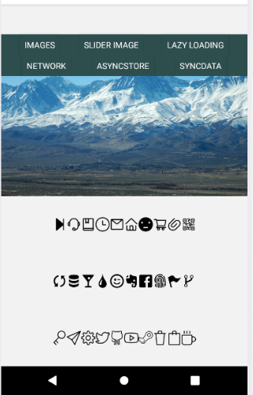

Kod:

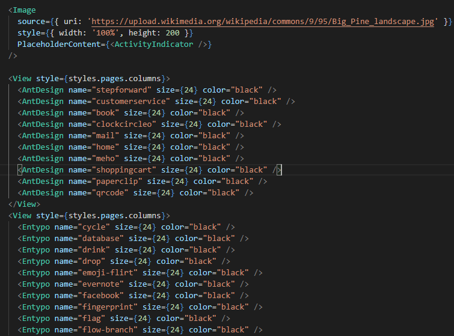

Detekcja łączności i wyświetlenie informacji z tym związanych:

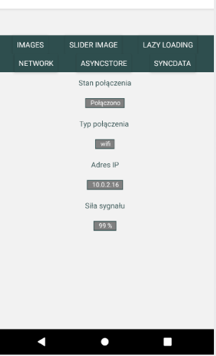

Kod:

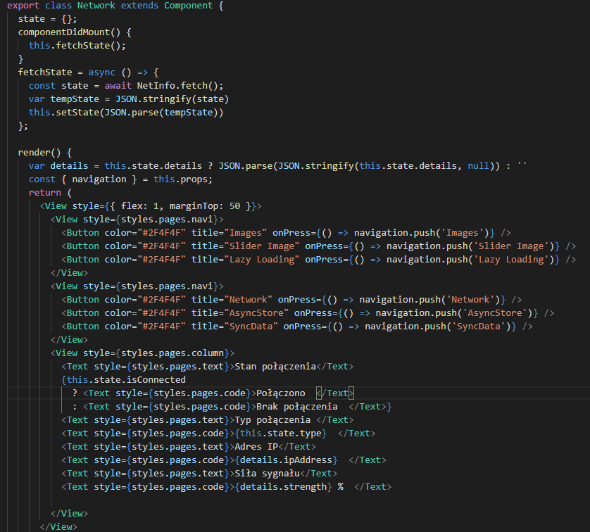

Zapis i odczyt danych przy pomocy AsyncStorage:

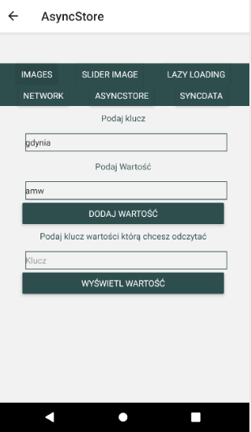

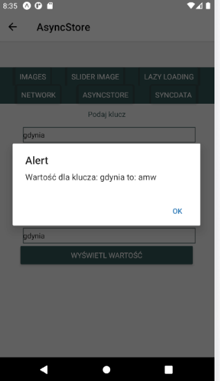

Kod:

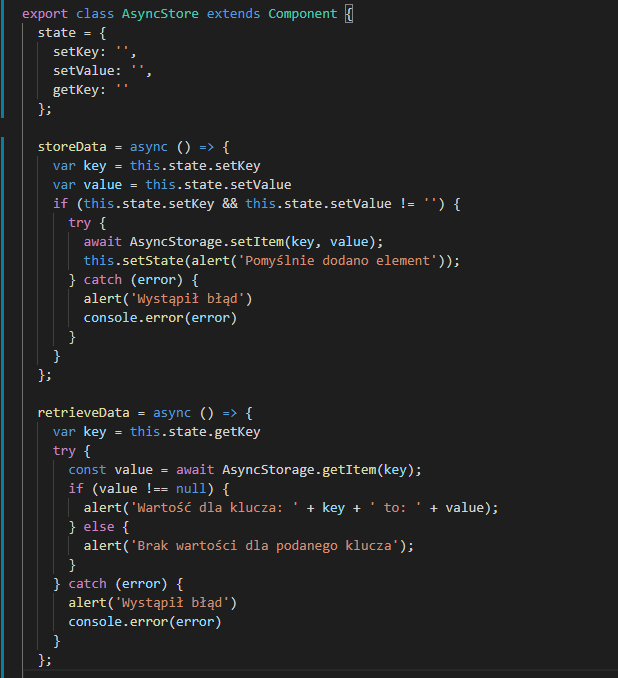

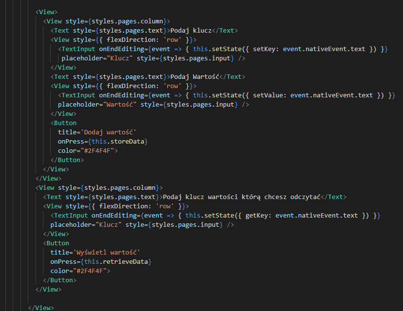

Synchronizacja danych (wartości suwaka) w przypadku łączności z siecią - przy braku internetu wartość nie jest aktualizowana:

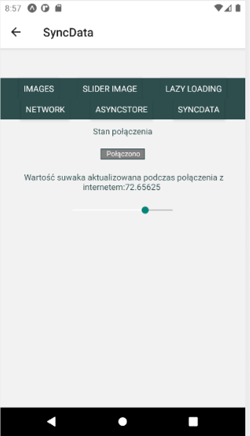

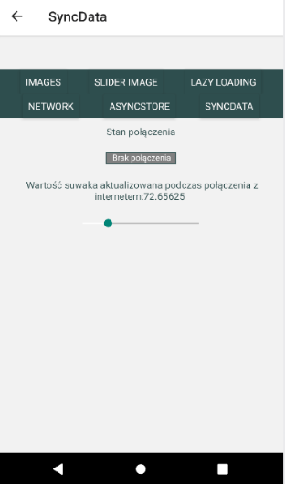

Kod:

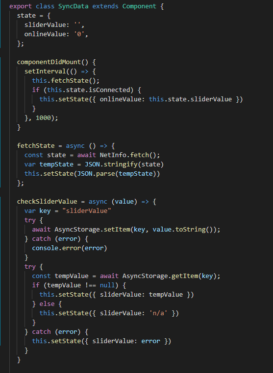

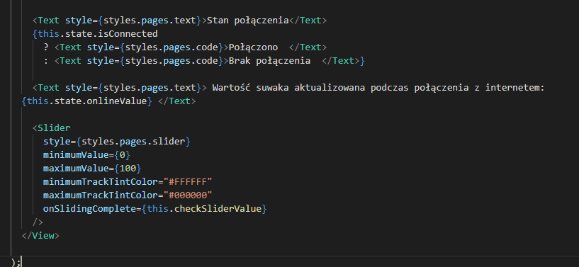