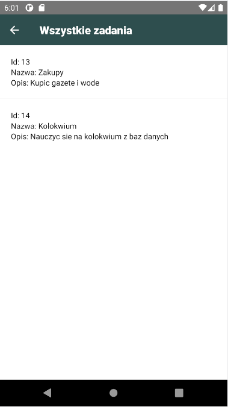

# Lab6
Do stworzenia projektu wykorzystano React Native Cli.

W ramach laboratorium wykonano aplikację ToDo komunikującą się z bazą danych.

Aplikacja:
- dodaje wpisy do tabeli
- odczytuje pojedyńcze wpisy 
- odczytuje wszytskie wpisy z tabeli
- edytuje wpisy
- usuwa wpisy

## Zrzuty ekranu

Strona główna:

Dodawanie:

Usuwanie:

Wyświetanie jednego zadania:

Wyświetlanie wszystkich zadań: 

Edycja zadania:

Zadania po edycji:

